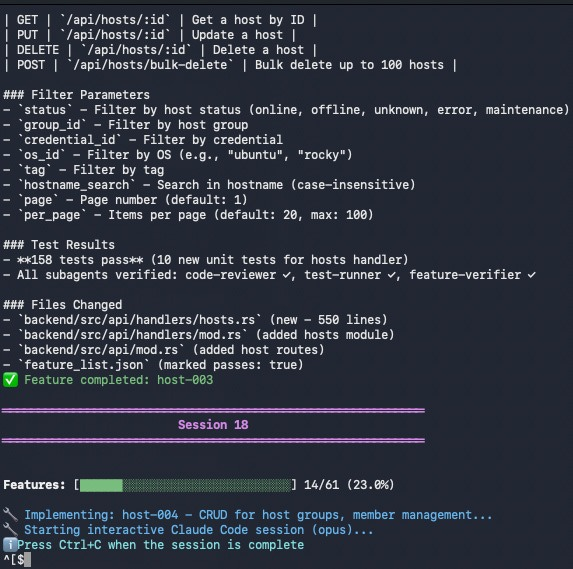

# Context Engine

**Autonomous project builder for Claude Code that doesn't forget what it's doing.**

Built 61 features for a Rust API server without human intervention. No degradation. No loops. No "I've lost track of what we're building."

## The Problem

AI coding agents degrade over long sessions. Context windows fill with stale information, the model loses track of decisions, and you end up babysitting what should be autonomous work.

This happens because most agent setups treat context like a pile - just keep adding until it breaks.

## The Solution

Context Engine uses a **four-layer memory architecture** based on research from Google, Stanford, and Anthropic:

| Layer | Purpose | Lifecycle |
|-------|---------|-----------|
| **Working Context** | Current task only | Rebuilt each session |
| **Episodic Memory** | Recent decisions, patterns | Rolling window |
| **Semantic Memory** | Project knowledge, architecture | Persistent |
| **Procedural Memory** | What worked, what failed | Append-only |

Each session starts fresh with computed context instead of accumulated garbage.

## Results

**PatchForge** - An agentless Linux patch management system in Rust:
- 61 features
- Fully autonomous (no human intervention after init)
- 158+ tests passing
- Subagents verifying each feature
- Zero context degradation

The loop runs overnight. Each session: compile context → implement feature → run tests → subagent review → commit → exit. Repeat until done.



## Quick Start

```bash
# Clone
git clone https://github.com/zeddy89/context-engine.git
cd context-engine

# Install (just copies scripts)
./install.sh

# Create a new project
python3 ~/tools/context-engine/orchestrator.py --new ~/projects/my-app --model opus

# Or run fully autonomous after init
~/tools/context-engine/loop-runner.py ~/projects/my-app --model opus
```

## Requirements

- [Claude Code](https://docs.anthropic.com/en/docs/claude-code) CLI installed
- Python 3.10+
- Git

## Usage

### New Project Setup

```bash
python3 orchestrator.py --new ~/projects/my-app --model opus
```

This will:
1. Create the project directory
2. Initialize git
3. Set up the context-engineered harness
4. **Open a shell for you to add MCPs** (type `exit` when done)
5. Run Session 1 to generate `feature_list.json`
6. Start the autonomous implementation loop

### Adding MCPs

During setup (or anytime), add MCPs via Claude Code CLI:

```bash
# Documentation lookup (recommended - get API key from ref.tools)
claude mcp add --transport http Ref https://api.ref.tools/mcp --header "x-ref-api-key: YOUR_KEY"

# Alternative docs (no key needed)
claude mcp add context7

# Browser automation for UI testing
claude mcp add playwright npx @playwright/mcp@latest

# Verify what's configured
claude mcp list
```

MCPs are registered with Claude Code directly - no config files needed.

### Autonomous Mode (Set and Forget)

After initialization:

```bash
./loop-runner.py ~/projects/my-app --model opus
```

This will:
1. Pick the next incomplete feature
2. Compile fresh context
3. Run Claude Code session
4. Use MCP tools for documentation lookup
5. Run tests
6. Invoke subagents for review
7. Commit and repeat

Stop it anytime with Ctrl+C. Resume later - it picks up where it left off.

### Continue Existing Project

```bash
python3 orchestrator.py --project ~/projects/my-app --model opus
```

### Check Status

```bash
python3 orchestrator.py --status --project ~/projects/my-app
```

## How It Works

### Project Structure

After initialization, your project gets:

```
my-app/
├── .agent/
│   ├── AGENT_RULES.md        # Memory model instructions
│   ├── working-context/      # Rebuilt each session
│   ├── memory/               # Persistent knowledge
│   │   ├── strategies/       # What worked, what failed
│   │   ├── entities/         # Discovered models, services
│   │   └── constraints/      # Project constraints
│   ├── artifacts/            # Large outputs by reference
│   ├── hooks/                # Context compilation scripts
│   └── workflows/            # Init, implement, debug workflows
├── .claude/
│   └── agents/               # Subagents (code-reviewer, test-runner)
├── feature_list.json         # Atomic features with status
└── CLAUDE.md                 # Instructions for Claude Code
```

### Session Flow

```
┌─────────────────────────────────────────────────────────────┐
│ Session Start                                               │
├─────────────────────────────────────────────────────────────┤
│ 1. Compile fresh working context                            │
│    └─ Pull relevant memory, not everything                  │
│ 2. Check failure log                                        │
│    └─ Don't repeat past mistakes                            │
│ 3. Look up docs via MCP (Ref, Context7)                     │
│ 4. Implement single feature                                 │
│ 5. Run tests (mandatory)                                    │
│ 6. Subagent review (@code-reviewer, @test-runner)           │
│ 7. Update feature_list.json                                 │
│ 8. Commit with "session: completed {feature_id}"            │
│ 9. Exit cleanly                                             │
└─────────────────────────────────────────────────────────────┘
                              │
                              ▼
                    Loop runner starts next session
```

### Feature List

Features are defined in `feature_list.json`:

```json
{
  "features": [
    {
      "id": "F001",
      "description": "Project scaffold with Cargo.toml",
      "priority": 1,
      "passes": true
    },
    {
      "id": "F002", 
      "description": "Database connection pool",
      "priority": 2,
      "dependencies": ["F001"],
      "passes": false
    }
  ]
}
```

The loop runner:
- Respects dependencies
- Skips completed features
- Marks blocked features after repeated failures
- Syncs with git history (recovers from missed updates)

## Configuration

### Models

```bash
--model sonnet    # Faster, good for most features (default)
--model opus      # Better for complex architecture decisions
```

### Flags

| Flag | Description |
|------|-------------|
| `--new PATH` | Create new project at path |
| `--project PATH` | Continue existing project |
| `--model MODEL` | sonnet or opus |
| `--mcp-preset NAME` | Suggest MCPs for preset (rust/python/node/web) |
| `--debug` | Show debug output |
| `--status` | Show project status |

## Subagents

The harness includes specialized subagents that Claude Code invokes during implementation:

| Agent | Purpose |
|-------|---------|
| `@code-reviewer` | Reviews changes for issues |
| `@test-runner` | Runs tests and analyzes failures |
| `@feature-verifier` | End-to-end feature verification |
| `@debugger` | Analyzes errors and suggests fixes |

## MCP Integration

MCPs give Claude access to documentation, databases, and tools during sessions.

### Recommended MCPs

```bash
# Documentation (pick one or both)
claude mcp add --transport http Ref https://api.ref.tools/mcp --header "x-ref-api-key: YOUR_KEY"
claude mcp add context7

# UI testing
claude mcp add playwright npx @playwright/mcp@latest

# Database access
claude mcp add postgres  # if using PostgreSQL
```

### Why MCPs Matter

Without MCP, Claude guesses at APIs based on training data (potentially outdated).

With Ref MCP, Claude looks up current documentation before writing code. Fewer hallucinated APIs, fewer test failures.

## Troubleshooting

### "feature_list.json not created"

The init session didn't complete properly. Run:

```bash
cd ~/projects/my-app
claude --model opus -p "Read .agent/workflows/init.md and create feature_list.json"
```

### Features completed but not marked

The harness auto-syncs with git history. If a commit says "session: completed F003" but `feature_list.json` shows `passes: false`, the next loop iteration fixes it.

### No MCPs showing up

MCPs must be added via `claude mcp add`, not a config file:

```bash
cd ~/projects/my-app
claude mcp add context7
claude mcp list  # verify it's there
```

### Tests not running

The harness enforces tests, but Claude might skip them. Check:

1. Test framework is set up (`cargo test` / `pytest` / `npm test` works manually)
2. CLAUDE.md mentions test requirements
3. Run with `--debug` to see what's happening

## Architecture Deep Dive

See [docs/ARCHITECTURE.md](docs/ARCHITECTURE.md) for the full explanation of:

- Four-layer memory model
- Context compilation algorithm  
- Artifact reference system
- Feedback capture loop

## Contributing

Issues and PRs welcome. This is actively developed.

Key areas:
- More MCP integrations
- Better test enforcement
- Support for other AI coding tools (Cursor, Aider, etc.)
- Parallel feature implementation

## License

MIT - 2025 Sheldon Lewis

## Acknowledgments

- Research foundation from Google's MemGPT, Stanford's Generative Agents, and Anthropic's context management papers
- Nate's Substack for the "computed context" mental model
- Built for use with [Claude Code](https://docs.anthropic.com/en/docs/claude-code)
